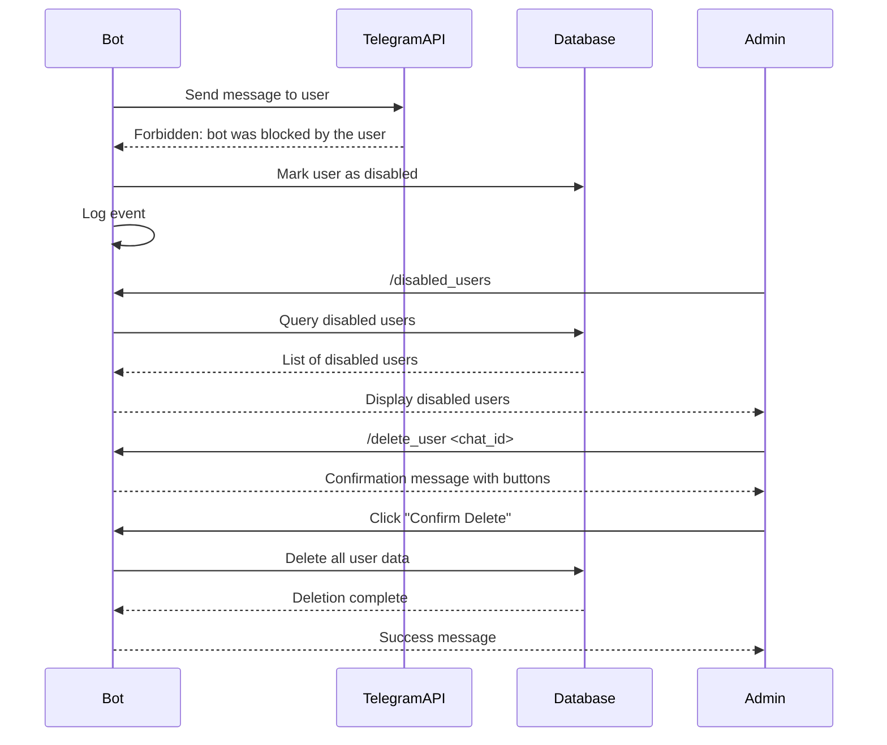

# Design Document

## Overview

This feature adds automatic detection and management of blocked users in the Lonchera Telegram bot. When a user blocks the bot, the system will catch the `telegram.error.Forbidden` exception, mark the user as disabled in the database, and provide admin commands to review and delete disabled users.

The design leverages the existing `ADMIN_USER_ID` environment variable pattern already used in the codebase for AI model access control.

## Architecture

### High-Level Flow



### Component Interaction

1. **Exception Handler**: Catches `telegram.error.Forbidden` exceptions in `tx_messaging.py`
2. **Database Layer**: Adds `is_disabled` field to Settings table and methods to manage disabled users
3. **Admin Commands**: New handlers in `handlers/admin.py` for `/disabled_users` and `/delete_user`
4. **Authorization**: Utility function to check if user is admin using `ADMIN_USER_ID` environment variable

## Components and Interfaces

### 1. Database Schema Changes

No schema changes required. We will leverage the existing `token` field in the `Settings` table to indicate blocked users by setting it to the special value `"blocked"`.

This follows the existing pattern where `token = "revoked"` indicates a user whose Lunch Money API token was revoked.

Special token values:
- `"revoked"`: User's Lunch Money API token was revoked
- `"blocked"`: User has blocked the Telegram bot

### 2. Constants (constants.py)

Add constants for special token values:

```python
# Special token values
TOKEN_REVOKED = "revoked"  # User's Lunch Money API token was revoked
TOKEN_BLOCKED = "blocked"  # User has blocked the Telegram bot
```

### 3. Database Methods (persistence.py)

Add new methods to the `Persistence` class:

```python
def mark_user_as_blocked(self, chat_id: int) -> None:
    """Mark a user as blocked by setting token to 'blocked'."""
    
def get_blocked_users(self) -> list[tuple[int, int, int, int]]:
    """Get all blocked users with their chat_id and counts of 
    transactions, settings, and analytics records."""
    
def is_user_blocked(self, chat_id: int) -> bool:
    """Check if a user is blocked (token == 'blocked')."""
    
def delete_user_data(self, chat_id: int) -> dict[str, int]:
    """Delete all data for a user and return counts of deleted records."""
```

Update existing method to use constant:

```python
def get_user_count(self) -> int:
    """Get count of active users (excluding revoked and blocked)."""
    with self.Session() as session:
        return session.query(Settings).filter(
            Settings.token != TOKEN_REVOKED,
            Settings.token != TOKEN_BLOCKED
        ).count()
```

### 4. Exception Handling (tx_messaging.py)

Modify `send_transaction_message` to catch and handle `Forbidden` exceptions:

```python
async def send_transaction_message(...) -> int:
    try:
        # existing message sending logic
    except telegram.error.Forbidden as e:
        if "bot was blocked by the user" in str(e):
            logger.warning(f"User {chat_id} has blocked the bot, marking as blocked")
            get_db().mark_user_as_blocked(int(chat_id))
            # Don't re-raise, just return gracefully
            return -1  # Sentinel value indicating failure
        else:
            raise
    except Exception:
        logger.exception(f"Failed to send message for chat_id {chat_id}")
        raise
```

### 5. Polling Logic (handlers/transactions.py)

Update existing logic to also skip blocked users (currently only skips revoked):

```python
async def poll_transactions_on_schedule(context: ContextTypes.DEFAULT_TYPE):
    db = get_db()
    registered_chats = db.get_all_registered_chats()
    
    for chat_id in registered_chats:
        settings = db.get_current_settings(chat_id)
        
        # Skip revoked users (existing logic)
        if settings.token == TOKEN_REVOKED:
            logger.debug(f"Skipping chat {chat_id} because API token was revoked.")
            continue
        
        # Skip blocked users (new logic)
        if settings.token == TOKEN_BLOCKED:
            logger.debug(f"Skipping chat {chat_id} because user blocked the bot.")
            continue
            
        # existing polling logic
```

### 6. Admin Authorization Utility (utils.py)

Add a utility function to check admin privileges:

```python
def is_admin_user(chat_id: int) -> bool:
    """Check if the given chat_id belongs to an admin user.
    
    Admin users are defined by the ADMIN_USER_ID environment variable,
    which can be a single ID or comma-separated list of IDs.
    """
    admin_ids = os.getenv("ADMIN_USER_ID", "")
    if not admin_ids:
        return False
    
    admin_id_list = [int(id.strip()) for id in admin_ids.split(",") if id.strip()]
    return chat_id in admin_id_list
```

### 7. Admin Command Handlers (handlers/admin.py)

Create a new file for admin-specific handlers:

```python
async def handle_blocked_users(update: Update, context: ContextTypes.DEFAULT_TYPE):
    """Handle /blocked_users command - list all blocked users."""
    
async def handle_delete_user(update: Update, context: ContextTypes.DEFAULT_TYPE):
    """Handle /delete_user <chat_id> command - delete a blocked user."""
    
async def handle_btn_confirm_delete_user(update: Update, context: ContextTypes.DEFAULT_TYPE):
    """Handle confirmation button for user deletion."""
    
async def handle_btn_cancel_delete_user(update: Update, context: ContextTypes.DEFAULT_TYPE):
    """Handle cancel button for user deletion."""
```

### 8. Command Registration (main.py)

Add admin command handlers to the application:

```python
def add_command_handlers(app):
    # ... existing handlers ...
    app.add_handler(CommandHandler("blocked_users", handle_blocked_users))
    app.add_handler(CommandHandler("delete_user", handle_delete_user))
```

Add callback query handlers for confirmation buttons:

```python
def add_application_callback_query_handlers(app):
    # ... existing handlers ...
    app.add_handler(CallbackQueryHandler(handle_btn_confirm_delete_user, pattern=r"^confirmDeleteUser_"))
    app.add_handler(CallbackQueryHandler(handle_btn_cancel_delete_user, pattern=r"^cancelDeleteUser$"))
```

## Data Models

### Token Field Special Values

The existing `token` field in the Settings table uses special string values to indicate user status:

| Value | Description |
|-------|-------------|
| Valid token string | Active user with valid Lunch Money API token |
| `"revoked"` | User's Lunch Money API token was revoked |
| `"blocked"` | User has blocked the Telegram bot |

### BlockedUserInfo (Return Type)

```python
@dataclass
class BlockedUserInfo:
    chat_id: int
    transaction_count: int
    settings_count: int  # Always 1 if exists
    analytics_count: int
```

## Error Handling

### Exception Handling Strategy

1. **Forbidden Exception**: Catch specifically in `send_transaction_message` and mark user as disabled
2. **Database Errors**: Log and re-raise to be caught by global error handler
3. **Authorization Errors**: Send "Unauthorized" message to user, don't log as error
4. **Invalid Input**: Send helpful error message to user (e.g., invalid chat_id format)

### Edge Cases

1. **User already disabled**: Idempotent operation, no error
2. **User not found**: Return error message to admin
3. **User not disabled**: Prevent deletion, return error message
4. **Empty disabled users list**: Return friendly "no disabled users" message
5. **Multiple admin users**: Support comma-separated list in `ADMIN_USER_ID`

## Testing Strategy

### Unit Tests

1. **Database Methods**:
   - Test `mark_user_as_blocked` sets token to "blocked"
   - Test `get_blocked_users` returns correct data with counts
   - Test `is_user_blocked` returns correct boolean
   - Test `delete_user_data` deletes all records and returns correct counts
   - Test `get_user_count` excludes both revoked and blocked users

2. **Authorization**:
   - Test `is_admin_user` with single admin ID
   - Test `is_admin_user` with multiple admin IDs (comma-separated)
   - Test `is_admin_user` with no admin ID configured
   - Test `is_admin_user` with invalid format

3. **Exception Handling**:
   - Test `send_transaction_message` catches Forbidden exception
   - Test `send_transaction_message` marks user as blocked
   - Test `send_transaction_message` doesn't re-raise Forbidden exception

### Integration Tests

1. **End-to-End Flow**:
   - Simulate user blocking bot
   - Verify user token is set to "blocked"
   - Verify polling skips blocked user
   - Admin lists blocked users
   - Admin deletes user
   - Verify all data is deleted

2. **Authorization Flow**:
   - Non-admin tries to use admin commands
   - Admin successfully uses admin commands

### Manual Testing

1. Test with real Telegram bot:
   - Block bot from user account
   - Verify bot sets user token to "blocked"
   - Use admin commands to list and delete user
   - Verify data is deleted from database

## Security Considerations

1. **Admin Authorization**: Only users in `ADMIN_USER_ID` can access admin commands
2. **Data Deletion**: Require explicit confirmation before deleting user data
3. **Logging**: Log all admin actions (list disabled users, delete user) for audit trail
4. **Input Validation**: Validate chat_id format before processing
5. **Error Messages**: Don't expose sensitive information in error messages to non-admin users

## Migration Strategy

### Database Migration

No database migration required. We're leveraging the existing `token` field with a new special value `"blocked"`.

This follows the existing pattern where `token = "revoked"` is already used for users whose Lunch Money API token was revoked.

### Deployment Steps

1. Deploy code changes
2. Set `ADMIN_USER_ID` environment variable (if not already set)
3. Restart bot
4. Test admin commands

## Performance Considerations

1. **Polling Optimization**: Checking `token == "blocked"` adds minimal overhead (string comparison on indexed field)
2. **Blocked Users Query**: Query is infrequent (admin-only) and uses indexed token field
3. **Deletion Performance**: Deletion is transactional and uses indexed chat_id field
4. **No Impact on Normal Users**: Feature only affects blocked users and admin operations
5. **Consistent with Existing Pattern**: Uses same approach as "revoked" token handling

## Future Enhancements

1. **Auto-cleanup**: Scheduled job to delete blocked users after X days
2. **Re-enable Users**: Command to re-enable a blocked user if they unblock the bot
3. **Notification**: Notify admin when a user blocks the bot
4. **Metrics**: Track blocked user count in analytics
5. **Bulk Operations**: Delete multiple blocked users at once
6. **Unified Management**: Single command to view both revoked and blocked users
